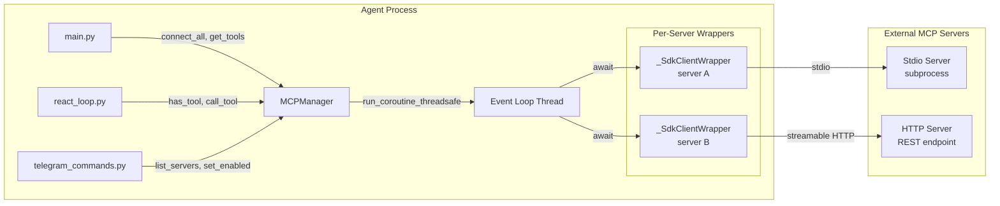

## Context

The codebase currently has ~500 lines of hand-rolled MCP transport code in `mcp_client.py`: subprocess management, JSON-RPC 2.0 framing over stdin/stdout, SSE parsing, HTTP session tracking, and cursor-based pagination. The official `mcp` Python SDK (v1.27.0+) provides all of this as a maintained library. The public API (`MCPManager` and `MCPManagerProtocol`) is well-defined and used by `main.py`, `react_loop.py`, and `telegram_commands.py` — none of which should change.

The SDK is fully async and uses anyio-based context managers; the codebase is synchronous. The design must bridge this gap without cascading changes.

### Component Diagram



- **MCPManager**: owns the event loop thread, routes tool calls to the correct server wrapper, maintains `_tool_to_server` mapping and `_enabled` state. Public API unchanged.
- **Event Loop Thread**: daemon thread running `asyncio.run_forever()`. All SDK operations execute here.
- **_SdkClientWrapper** (one per server): holds a long-lived session-runner coroutine that enters the `ClientSession` context and stays alive. Tool calls are dispatched via an `asyncio.Queue` — the wrapper enqueues a request, the session runner processes it, and the result is returned through a future.

## Goals / Non-Goals

**Goals:**
- Replace custom transport code with the official `mcp` SDK (v1.27.x, pinned `<2.0`)
- Keep `MCPManager` public API and `MCPManagerProtocol` identical
- Keep config format and `MCPServerConfig` identical
- Bridge async SDK to sync callers via a background event loop thread
- Remove `requests` dependency

**Non-Goals:**
- Change any caller (`main.py`, `react_loop.py`, `telegram_commands.py`, `builtin_tools/schemas.py`)
- Add new MCP features (resources, prompts, sampling) — those come free with the SDK but are not explicitly wired
- Change the `Tool` dataclass or `ToolRegistry` MCP integration
- Make the ReAct loop async

## Decisions

### D1: Background event loop thread with per-server session runners

**Choice**: MCPManager spawns a daemon thread running `loop.run_forever()`. Each `_SdkClientWrapper` runs a long-lived session-runner coroutine on that loop. The session runner enters the `ClientSession` async context and stays inside it, processing tool-call requests from an `asyncio.Queue`.

**Why not separate coroutines per call**: The SDK's `stdio_client` and `ClientSession` are anyio-based async context managers. Their cancel scopes must be entered and exited on the same asyncio task. Dispatching `_connect_async` and `_close_async` as separate `run_coroutine_threadsafe` calls would trigger "attempted to exit cancel scope in a different task" RuntimeError. A single long-lived session-runner coroutine per server keeps enter/exit on the same task.

**Pattern**:
```python
class _SdkClientWrapper:
    async def _session_runner(self):
        """Runs for the lifetime of this server connection."""
        async with stdio_client(params) as (read, write):
            async with ClientSession(read, write) as session:
                await session.initialize()
                # Follow pagination cursors to collect all tools
                all_tools = []
                cursor = None
                while True:
                    page = await session.list_tools(cursor=cursor) if cursor else await session.list_tools()
                    all_tools.extend(page.tools)
                    cursor = getattr(page, 'nextCursor', None)
                    if not cursor:
                        break
                self._tools = _sdk_tools_to_registry(self.name, all_tools)
                self._ready_future.set_result(True)  # signal connect complete
                while True:
                    req = await self._queue.get()
                    if req is None:  # shutdown sentinel
                        break
                    try:
                        result = await session.call_tool(req.name, req.args)
                        req.future.set_result(_sdk_result_to_outcome(result))
                    except Exception as e:
                        req.future.set_result(_tool_outcome(error=str(e), success=False))
```

**Sync bridge**: `call_tool()` enqueues a request via `self._loop.call_soon_threadsafe(self._queue.put_nowait, req)`, then blocks on `req.future.result(timeout=...)`. The session runner processes it on the event loop and sets the result. `call_soon_threadsafe` + `put_nowait` is used instead of `run_coroutine_threadsafe(queue.put)` because the coroutine form returns a `concurrent.futures.Future` for the `put` itself — on caller timeout that future is abandoned, leaving `req.future` unresolved and the caller hanging indefinitely. `put_nowait` is synchronous and safe to schedule this way since the queue is unbounded and the session runner always drains it.

**Alternatives considered**:
- `asyncio.run()` per call: creates/destroys event loop per tool call, can't reuse connections, conflicts if called from within an existing loop. Rejected.
- Make everything async: massive refactor touching react_loop.py, agent_controller.py, agent_runtime.py. Risk/reward too high. Rejected.

### D2: _SdkClientWrapper per server

Each configured MCP server gets a `_SdkClientWrapper` instance that:
- Holds the session-runner coroutine (a `Task` on the event loop)
- Provides `connect()` (sync, blocks until session runner signals ready), `call_tool()` (sync, enqueues + blocks on future), `close()` (sync, sends shutdown sentinel)
- Tracks `connected: bool` and `last_error: str` for `list_servers()` / `get_server_info()`
- Maps SDK types to our legacy dict format

### D3: Transport selection and SDK symbols

SDK v1.27.x uses these symbols (confirmed by SDK research):

```python
from mcp import ClientSession
from mcp.client.stdio import stdio_client, StdioServerParameters, get_default_environment
from mcp.client.streamable_http import streamablehttp_client
from mcp.client.sse import sse_client
```

| Config `transport` | SDK path |
|---|---|
| `"stdio"` | `stdio_client(StdioServerParameters(command=cfg.command[0], args=cfg.command[1:], env=merged_env))` → yields `(read, write)` → `ClientSession(read, write)` |
| `"http"` | `streamablehttp_client(cfg.url, headers=cfg.headers)` → yields `(read, write, _)` → `ClientSession(read, write)` |
| `"sse"` | `sse_client(cfg.url, headers=cfg.headers)` → yields `(read, write)` → `ClientSession(read, write)` |

**Stdio env merge**: The SDK does not inherit the parent process environment. `get_default_environment()` provides a safe allowlist of env vars (PATH, HOME, etc.) which is merged with `cfg.env` before passing to `StdioServerParameters`. This replaces a raw `os.environ` merge to avoid leaking secrets to subprocess stdio servers.

**HTTP / SSE**: `streamablehttp_client` returns a 3-tuple `(read, write, _)`; we discard the third element. `sse_client` returns a 2-tuple `(read, write)`. Both accept `headers` for auth tokens.

### D4: Result mapping

SDK v1.x `CallToolResult` uses camelCase attributes (`isError`, `content`). Mapping to our `{"success": bool, "output": str, "error": str, "exit_code": int}` dict:

| SDK content item | Output string |
|---|---|
| `TextContent` (`.type == "text"`) | Append `.text` |
| `ImageContent` (`.type == "image"`) | Append `[image: {mimeType}]` |
| `EmbeddedResource` (`.type == "resource"`) | Append `[resource: {.resource.uri}]` |
| `AudioContent` (`.type == "audio"`) | Append `[audio: {mimeType}]` |
| `ResourceLink` (`.type == "resource_link"`) | Append `[resource_link: {uri}]` |

If `result.isError` is True, the flattened text goes into the `error` field with `success=False` and `exit_code=1`. Otherwise it goes into `output` with `success=True` and `exit_code=0`. The `exit_code` field is preserved for backward compatibility with the current `_tool_outcome()` contract.

### D5: Tool mapping

SDK v1.x `Tool` uses camelCase attributes (`name`, `description`, `inputSchema`). Mapping to our `Tool` dataclass:

| SDK field | Our field |
|---|---|
| `t.name` | `name` |
| `t.description` | `description` (fallback: `f"MCP tool '{name}' from {server_name}"`) |
| `t.inputSchema` | `input_schema` (both are `dict[str, Any]`, identical format) |
| — | `path=""`, `language="mcp"`, `is_mcp=True`, `server_name=<name>` |

### D6: Error handling and server state

All SDK exceptions (`MCPError`, `RuntimeError`, etc.) are caught in the session runner and converted to `{"success": False, "error": str(e), "exit_code": 1}`. No new exception types leak out of `mcp_client.py`.

**Server state tracking**: Each `_SdkClientWrapper` maintains:
- `connected: bool` — set True after successful `initialize()` + `list_tools()`, set False on any connection error or close
- `last_error: str` — set on any connection or tool-call error

These feed `MCPManager.list_servers()` and `get_server_info()`, preserving the current `/mcp list` and `/mcp info` behavior. A protocol-mismatch `RuntimeError` during connect sets `connected=False` and `last_error=str(e)`, which surfaces as `status: "error"` in `list_servers()`.

### D7: Thread safety

A single `threading.Lock()` protects `_tool_to_server` dict and `_wrappers` dict. These are read by `call_tool()`/`has_tool()` (from agent threads) and written by `connect_server()`/`set_enabled()` (from main or Telegram threads). The event loop itself is single-threaded — all SDK operations serialize naturally. Cross-thread dispatch to the per-wrapper `asyncio.Queue` goes through `asyncio.run_coroutine_threadsafe(queue.put(req), loop)` since `asyncio.Queue` is not thread-safe.

### D8: Connection loss

On stdio subprocess death, the SDK's transport layer handles reconnection internally. If a `call_tool()` raises due to connection loss, the session runner catches it, sets `connected=False` and `last_error=str(e)`, and returns a standard tool failure dict. No silent auto-restart as in the current `MCPStdioClient._is_alive()` check. The agent's ReAct loop already handles tool failures gracefully — it reports the error to the LLM and continues.

### D9: Timeout wiring

Per-server `cfg.timeout` (default 30s) is applied at two levels:
- **Tool call timeout**: `req.future.result(timeout=cfg.timeout)` in the sync `call_tool()` method. If the session runner doesn't respond within the timeout, a `concurrent.futures.TimeoutError` is caught and returned as a tool failure.
- **Connect timeout**: `self._ready_future.result(timeout=cfg.timeout)` in the sync `connect()` method, waiting for the session runner to signal completion. `_ready_future` is a `concurrent.futures.Future` (not an `asyncio.Event`) so it can be awaited from the sync caller thread.

The SDK's own HTTP timeouts are handled internally by `httpx`; we don't need to configure them separately.

## Risks / Trade-offs

- **[Risk] SDK API instability within v1.x** → Mitigation: pin `mcp>=1.27.0,<2.0`. The wrapper is ~100 lines per server; adapting to minor API changes is low-cost.
- **[Risk] Event loop thread crash takes down all MCP servers** → Mitigation: daemon thread is tied to MCPManager lifecycle. If it crashes, the session runners die, callers get error dicts via timeout. Acceptable — today a single unhandled exception in the transport layer also breaks the manager.
- **[Risk] Session-runner queue deadlock** → Mitigation: `future.result(timeout=...)` prevents indefinite blocking. If the session runner dies, the future never resolves, the timeout fires, and the caller gets an error dict.
- **[Trade-off] No per-call subprocess health check** → Today's code checks `_is_alive()` before every stdio call. The SDK manages transport lifecycle internally. We trade a proactive health check for simpler code; the SDK's transport layer is more robust than our hand-rolled subprocess management.
- **[Trade-off] Per-server wrapper complexity** → The session-runner + queue pattern is more complex than a simple coroutine-per-call, but it's required by the anyio same-task constraint. The alternative (fighting the SDK's context manager lifecycle) would be more fragile.

## Migration Plan

1. Add `mcp>=1.27.0,<2.0` to `requirements.txt`
2. Rewrite `mcp_client.py` (keep public API, replace internals with session-runner pattern)
3. Rewrite `tests/test_mcp_client.py` (mock `ClientSession` and transport functions)
4. Remove `requests` from `requirements.txt`
5. Integration smoke test: start agent, verify `/mcp list`, run a tool through ReAct loop, test `/mcp off` → `/mcp on` lifecycle

**Rollback**: revert `mcp_client.py`, `tests/test_mcp_client.py`, and `requirements.txt` to previous versions. No data migration, no config changes.

## Open Questions

<!-- All open questions from the brief are resolved in the decisions above. No outstanding unknowns. -->
