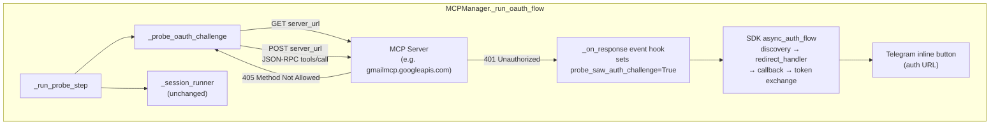

## Context

The proactive OAuth probe was introduced in the archived change `2026-08-07-proactive-oauth-401-probe`. It sends a standalone HTTP GET to the MCP server URL with `auth=provider` before connecting the MCP session. The SDK's `OAuthClientProvider` (an `httpx.Auth` subclass) fires its `async_auth_flow` on a 401 response, driving the full OAuth handshake (discovery → redirect_handler → callback → token exchange).

The probe works for servers that challenge unauthenticated GET with 401. It fails for Gmail's MCP server (`gmailmcp.googleapis.com/mcp/v1`), which only accepts POST on its streamable-http endpoint and returns 405 on GET. Since 405 is not an auth challenge, `probe_saw_auth_challenge` stays `False`, the OAuth flow never fires, and the session connects without a token via `initialize` (which Gmail allows unauthenticated). The operator never sees the authorization URL in Telegram.

Research across GitHub (GoogleCloudPlatform/generative-ai, modelcontextprotocol/python-sdk, langchain-ai/deepagents, abstracta/tero, sybil-solutions/local-studio) confirms:
- Gmail's MCP server returns 405 on GET, 200 on unauthenticated POST `initialize`, and 401 on unauthenticated POST `tools/call`.
- The SDK's `async_auth_flow` only enters the OAuth branch on 401 (or 403 insufficient-scope).
- No public SDK API exists to manually trigger the OAuth flow without a 401.

The probe lives in `_probe_oauth_challenge` (`mcp_client.py:913-995`), called by `_run_probe_step` (`mcp_client.py:997-1105`), called by `_run_oauth_flow` (`mcp_client.py:1107-1257`). The event hook `_on_response` records 401/403 status codes. The session connection path (`_session_runner`) is unchanged by this design.



- **Boundary**: The change is confined to `_probe_oauth_challenge`. Everything downstream (`_run_probe_step`, `_run_oauth_flow`, `_session_runner`, callback server, token storage) is unchanged.
- **Responsibility**: `_probe_oauth_challenge` triggers a 401 from the server's auth middleware. The SDK's `async_auth_flow` does the rest.
- **Key relationship**: The httpx `event_hooks={"response": [_on_response]}` fires on every response through the client, including the intermediate 401 that triggers the auth flow. This is how `probe_saw_auth_challenge` is set.
- **Assumption**: Auth middleware runs before MCP protocol handling, so a `tools/call` to a non-existent tool still returns 401 when no token is present.
- **Open question**: None — all resolved during exploration.

## Goals / Non-Goals

**Goals:**
- Trigger the SDK's OAuth handshake for MCP servers that return 405 on GET (POST-only endpoints like Gmail).
- Preserve existing behavior for servers that accept GET (200 = no OAuth needed, 401 = OAuth fires).
- Reuse 100% of the SDK's OAuth machinery — no manual discovery, registration, or token exchange.
- Keep the change confined to `_probe_oauth_challenge` — no changes to session connection, callback server, or token storage.

**Non-Goals:**
- Supporting non-MCP OAuth flows (e.g. Gmail REST API wrapper).
- Subclassing `OAuthClientProvider` or calling SDK internals like `_perform_authorization`.
- Changes to the session connection path, callback server lifecycle, or token storage.
- Detecting whether a server requires OAuth at runtime without an `oauth` config section.

## Decisions

### D1: GET→405→POST retry (not POST-only)

**Decision:** The probe sends GET first. If GET returns 405, retry with POST containing a JSON-RPC `tools/call` body. If GET returns any other status (200, 401, 403, 5xx), no POST is sent — existing behavior applies.

**Rationale:** GET-first preserves the existing "server does not require OAuth" detection path for servers that accept GET and return 200. POST-only would also work (those servers accept POST and return 200), but GET-first is strictly additive — servers that already work are provably unaffected because no POST is sent on GET success. The 405 retry is the only new code path.

**Alternatives considered:**
- *POST-only (no GET)* — Simpler (one code path), but loses the GET-accepting server detection. Rejected: the GET path is already working for some servers; no reason to remove it.
- *POST-first with GET fallback* — MCP servers accept POST by spec, so a 405 on POST would be unusual. Rejected: GET-first is the conservative choice that preserves existing behavior.

### D2: POST body is JSON-RPC `tools/call` with dummy tool name

**Decision:** The POST body is a JSON-RPC 2.0 request:
```json
{
  "jsonrpc": "2.0",
  "id": "<random UUID>",
  "method": "tools/call",
  "params": {"name": "_oauth_probe", "arguments": {}}
}
```

**Rationale:** `tools/call` is the MCP method that OAuth-protected servers gate behind auth middleware. Gmail returns 401 on unauthenticated `tools/call` before checking tool existence or session state. The dummy tool name `_oauth_probe` (prefixed with `_` to signal non-standard) ensures no real tool is called if auth is somehow bypassed. A random UUID for `id` satisfies JSON-RPC 2.0 validity.

**Alternatives considered:**
- *`initialize` method* — Gmail returns 200 on unauthenticated `initialize`, so no 401 fires. Defeats the purpose.
- *`ping` method* — Some servers may not implement it; auth middleware behavior is less certain. Less reliable than `tools/call`.
- *Real tool name from `tools/list`* — Requires calling `tools/list` first (which may return 200 without auth), adding an extra round-trip and coupling the probe to server-specific tool names.

### D3: POST headers match SDK streamable_http transport

**Decision:** The POST request carries:
```
Accept: application/json, text/event-stream
Content-Type: application/json
MCP-Protocol-Version: 2025-11-25
```

**Rationale:** These are the exact headers the SDK's `streamable_http` transport sends on every POST (`_prepare_headers` in `mcp/client/streamable_http.py:148-163`). Matching them ensures the server treats the probe as a valid MCP request and routes it through the same auth middleware that protects real MCP requests. The `MCP-Protocol-Version` header is already set on the GET probe (existing `_PROBE_MCP_PROTOCOL_VERSION` constant) and is read by the SDK's `async_auth_flow` to decide whether to include the RFC 8707 `resource` parameter.

### D4: POST 405 (or other unexpected status) → WARNING + session fallback

**Decision:** If the POST probe returns 405 (or any status other than 200, 401, 403), log a WARNING for unexpected status and proceed to session connection as fallback — same as the current behavior for unexpected GET statuses.

**Rationale:** A 405 on POST would mean the server is not a valid MCP streamable_http server (they accept POST by spec). The session connection fallback gives the SDK a second chance to trigger OAuth during `session.initialize()`. This is the existing safety net, unchanged.

**Logging contract:** The INFO/WARNING logs at the end of `_probe_oauth_challenge` (lines 985-994) and the unexpected-status WARNING in `_run_probe_step` (lines 1082-1099) must reflect the **final** status — the POST result when a POST retry occurred, not the intermediate GET 405. If the GET returns 405 and a POST is issued, `final_status` must be updated to the POST response status before the logging block runs, so the INFO line does not falsely report "probe returned 405 — server did not require OAuth." The POST-405 case relies on returning `final_status=405` through the existing `_run_probe_step` WARNING path — no new duplicate WARNING should be added inside `_probe_oauth_challenge`.

### D5: Event hook unchanged

**Decision:** The existing `_on_response` event hook (`mcp_client.py:948-951`) remains unchanged. It fires on every response through the httpx client, including the 401 from the POST probe.

**Rationale:** The hook is method-agnostic — it checks `response.status_code in (401, 403)` regardless of whether the request was GET or POST. No changes needed.

## Risks / Trade-offs

- **[Server returns 405 on both GET and POST]** → The server is not a valid MCP streamable_http server. Mitigation: log WARNING, proceed to session connection fallback. The session's `initialize` may still trigger a 401 as a last resort.

- **[Server returns 200 on unauthenticated `tools/call`]** → The server allows unauthenticated tool calls; no OAuth is needed. Mitigation: `probe_saw_auth_challenge` stays `False`, the session connects without a token, and the INFO log "server did not require OAuth" fires. This is correct behavior.

- **[Server returns 401 on GET but 405 on POST]** → Unlikely (if GET triggers auth, POST should too). Mitigation: the GET 401 fires the OAuth flow before the POST retry is reached. The retry only happens on GET 405.

- **[POST body triggers a real tool call if auth is bypassed]** → The dummy tool name `_oauth_probe` does not exist on any real server, so a `tools/call` would return a JSON-RPC error (method not found / tool not found), not a tool result. Mitigation: the `_` prefix signals non-standard; no real MCP tool uses this naming convention.

- **[Extra HTTP round-trip for POST-only servers]** → The GET probe adds one wasted round-trip (405 response) before the POST probe. Mitigation: acceptable for an interactive flow that already takes seconds. The 405 response is fast (no body processing).

## Migration Plan

No migration needed. The change is purely additive to the probe step. Existing stored tokens continue to work (the non-interactive path is unchanged). Servers that accept GET are unaffected (no POST is sent on GET success).

**Rollback:** Revert the POST retry in `_probe_oauth_challenge`. The probe returns to GET-only behavior, which works for servers that challenge on GET but not for POST-only servers like Gmail.

## Open Questions

None. All resolved during exploration and grilling.