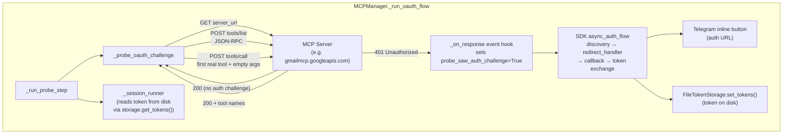

## Context

The proactive OAuth probe (`_probe_oauth_challenge` in `mcp_client.py`) sends a standalone HTTP request to the MCP server URL with `auth=provider` before connecting the MCP session. The SDK's `OAuthClientProvider` (an `httpx.Auth` subclass) fires its `async_auth_flow` on a 401 response, driving the full OAuth handshake (discovery → redirect_handler → callback_handler → token exchange → set_tokens → retry). The `redirect_handler` posts the authorization URL to Telegram as an inline button; the `callback_handler` awaits the operator completing auth on their device.

The probe currently sends GET first. If GET returns 401/403, OAuth fires immediately. If GET returns 200 or 405 without an auth challenge, it retries with a POST `tools/call` to a dummy tool name (`_oauth_probe`). Confirmed via curl against Gmail's MCP server (`gmailmcp.googleapis.com/mcp/v1`):

- GET → 200 (no auth middleware on GET)
- POST `initialize` → 200 (no auth needed for session init)
- POST `tools/list` → 200 (tool list is public)
- POST `tools/call` with dummy tool `_oauth_probe` → **200** (tool not found, JSON-RPC error, no auth check)
- POST `tools/call` with real tool `list_labels` + empty args `{}` → **401** (tool exists, auth required before execution)

Gmail enforces auth at the **tool execution layer**, not the HTTP middleware layer. The dummy-tool POST never triggers a 401 because the server checks tool existence before checking auth. Only a real tool name triggers the 401 that fires the OAuth handshake.

The probe and SDK transport share the same `OAuthClientProvider` object and the same `FileTokenStorage`. When the probe's `async_auth_flow` fires on the 401, it stores the token to disk via `storage.set_tokens()`. The SDK transport's `async_auth_flow` reads the token from disk via `storage.get_tokens()` on its next request. The shared `OAuthClientProvider` context state (`_initialized`, `context.protected_resource_metadata`) is also shared across generator invocations on the same object.

- **Boundary**: The change is confined to `_probe_oauth_challenge`. Everything downstream (`_run_probe_step`, `_run_oauth_flow`, `_session_runner`, callback server, token storage) is unchanged.
- **Responsibility**: `_probe_oauth_challenge` triggers a 401 from the server by calling a real tool. The SDK's `async_auth_flow` does the rest (discovery, redirect, callback, token exchange).
- **Key relationship**: The probe's `httpx.AsyncClient` shares the same `OAuthClientProvider` as the SDK transport. Token persistence is file-based via `FileTokenStorage`, so the token acquired by the probe is available to the SDK transport on session connection.
- **Assumption**: Auth middleware (or tool execution layer) runs before argument validation, so a real tool call with empty args still returns 401. Confirmed via curl: `list_labels` with `{}` returns 401, not an argument validation error.

## Goals / Non-Goals

**Goals:**
- Trigger the SDK's OAuth handshake for MCP servers that enforce auth at the tool execution layer (e.g. Gmail), not at the HTTP middleware layer.
- Preserve existing behavior for servers that challenge on GET (401/403 = OAuth fires immediately, no POST).
- Reuse 100% of the SDK's OAuth machinery — no manual discovery, registration, or token exchange.
- Keep the change confined to `_probe_oauth_challenge` — no changes to session connection, callback server, or token storage.
- Post the auth URL to Telegram via `redirect_handler` so the operator can authenticate on any device.

**Non-Goals:**
- Supporting non-MCP OAuth flows (e.g. Gmail REST API wrapper).
- Subclassing `OAuthClientProvider` or calling SDK internals.
- Changes to the session connection path, callback server lifecycle, or token storage.
- Refactoring to share a single `httpx.AsyncClient` between probe and SDK transport (file-based token persistence is sufficient).

## Decisions

### D1: Two-step discovery probe (tools/list → tools/call with real tool name)

**Decision:** When the GET probe returns 200 or 405 without an auth challenge, the probe sends POST `tools/list` to discover real tool names, then POST `tools/call` with the first real tool name and empty arguments `{}`. The 401 from the real tool call fires the SDK's `async_auth_flow`.

**Rationale:** Gmail returns 200 on `tools/call` with a dummy tool name (tool not found, no auth check) but 401 on `tools/call` with a real tool name (tool exists, auth required before execution). The two-step discovery probe is server-agnostic — it works for any MCP server that exposes `tools/list` without auth but requires auth for `tools/call`. Confirmed via curl that Gmail's `tools/list` response has `Content-Type: application/json; charset=UTF-8` (not SSE) and does not require a preceding `initialize`/session — the probe sends `tools/list` directly without a session ID.

**Response parsing:** The `tools/list` response may be `application/json` (bare JSON-RPC body) or `text/event-stream` (SSE-framed JSON-RPC). The probe parses both: if `Content-Type` is JSON, call `response.json()` directly; if SSE, concatenate `data:` frames and parse the concatenated JSON. Extract `result.tools[0].name` from the parsed JSON-RPC response. Confirmed via curl that Gmail returns `application/json` — but other MCP servers may return SSE, so both framings are handled.

**Alternatives considered:**
- *Hardcode a known-safe tool name (e.g. `list_labels`)* — Gmail-specific, breaks for other servers. Rejected.
- *Keep dummy-tool POST as fallback* — Proven not to work for Gmail. The dummy-tool POST returns 200, not 401. Rejected.
- *Call `tools/call` with a real tool name without `tools/list` first* — We don't know the tool names without calling `tools/list`. Rejected.

### D2: Use the first tool name from tools/list with empty arguments

**Decision:** The probe uses the first tool name from the `tools/list` response with empty arguments `{}`.

**Rationale:** Auth is checked before argument validation (confirmed via curl: `list_labels` with `{}` returns 401, not an argument error). Empty arguments minimize side effects — even if the tool somehow executes, it receives no meaningful input. The first tool is arbitrary — we don't need to find a read-only or no-required-args tool because the 401 fires before the tool runs.

**Alternatives considered:**
- *Search for a read-only tool with no required args* — More complex, requires parsing `inputSchema`. Unnecessary since auth fires before args are validated. Rejected.
- *Try all tools until one returns 401* — Wasteful. The first real tool name is sufficient. Rejected.

### D3: Fallback to session connection if tools/list returns empty or fails

**Decision:** If `tools/list` returns an empty tool list, fails with a non-200 status (and `probe_saw_auth_challenge` is False), or raises an exception, the probe logs a WARNING and falls back to session connection (existing safety net). If `tools/list` itself returns 401, the event hook sets `probe_saw_auth_challenge=True` and the OAuth flow fires — the fallback is suppressed (same as the existing GET-401 path).

**Rationale:** If we can't discover a real tool name, we can't trigger the 401. The session connection fallback gives the SDK a chance to trigger OAuth during `session.initialize()` or later tool calls. The `probe_saw_auth_challenge` guard ensures that if `tools/list` itself returns 401 (some servers may require auth for `tools/list`), the OAuth flow fires rather than falling back. This is the existing safety net, unchanged.

### D4: Remove _PROBE_TOOL_NAME constant

**Decision:** Remove the `_PROBE_TOOL_NAME = "_oauth_probe"` constant. The probe no longer uses a hardcoded dummy tool name — it discovers real tool names dynamically via `tools/list`.

**Rationale:** The dummy tool name was the root cause of the bug. Removing it prevents future confusion and ensures the probe always uses a real tool name from the server.

### D5: Standalone httpx.AsyncClient (not shared with SDK transport)

**Decision:** The probe continues using its own `httpx.AsyncClient` with `auth=provider` and `event_hooks={"response": [_on_response]}`. The token is persisted to disk via `FileTokenStorage`, which the SDK transport reads on session connection.

**Rationale:** The probe and SDK transport share the same `OAuthClientProvider` object and `FileTokenStorage`. The probe's `async_auth_flow` fires on the 401, calls `redirect_handler` (posts auth URL to Telegram), calls `callback_handler` (waits for operator), stores the token via `storage.set_tokens()`. The SDK transport's `async_auth_flow` reads the token via `storage.get_tokens()` on its first request. Refactoring to share a single `httpx.AsyncClient` would be a larger change with regression risk — file-based persistence is sufficient.

### D6: Response-size cap on tools/list (defense-in-depth)

**Decision:** The probe rejects `tools/list` responses exceeding `_PROBE_MAX_RESPONSE_BYTES` (1 MB) before parsing. Oversized responses log a WARNING and skip `tools/call`, falling through to session connection.

**Rationale:** httpx buffers the full response body before parsing. A malicious or compromised MCP server could return a multi-GB body within the 300-second timeout window and exhaust memory. A `tools/list` response is typically a few KB; 1 MB is a generous cap. The check inspects both the `Content-Length` header and the actual `len(response.content)` to handle servers that misreport or omit the header. This is defense-in-depth beyond the operator-initiated trusted-server threat model.

### D7: Prefer non-mutating tool names (defense-in-depth)

**Decision:** `_extract_first_tool_name` iterates through the tool list and returns the first tool whose name does NOT start with a known mutating prefix (`send_`, `delete_`, `write_`, `update_`, `create_`, `remove_`, `set_`, `put_`, `post_`, `add_`, `insert_`, `modify_`, `edit_`, `move_`, `rename_`, `clear_`, `reset_`, `upload_`, `submit_`, `execute_`, `run_`). If all tools are mutating, the probe skips `tools/call` and falls back to session connection.

**Rationale:** D2's safety argument ("auth fires before tool execution") is confirmed for Gmail but generalized to all servers. A server that executes before checking auth could run an arbitrary, unreviewed tool. Preferring non-mutating tools minimizes the risk of destructive side effects if a server executes before checking auth. If no safe tool is found, skipping `tools/call` is safer than calling a potentially destructive tool. This is defense-in-depth beyond the accepted risk documented in the Risks section.

## Risks / Trade-offs

- **[Server validates arguments before checking auth]** → The probe would get a 200 JSON-RPC argument error instead of 401. Mitigation: confirmed via curl that Gmail checks auth before args. If a server validates args first, the probe falls back to session connection (the `tools/call` returns 200, `probe_saw_auth_challenge` stays False, WARNING + fallback).

- **[tools/list requires auth]** → Some servers may return 401 on `tools/list` itself. Mitigation: the event hook catches 401 on the `tools/list` POST too, setting `probe_saw_auth_challenge=True`. The OAuth flow fires on the `tools/list` 401, not the `tools/call` 401. This is correct behavior — the probe triggers OAuth on whichever request returns 401 first.

- **[Extra HTTP round-trips for tools/list]** → The probe adds one extra round-trip (tools/list) before the tools/call. Mitigation: acceptable for an interactive flow that already takes seconds. The tools/list response is fast (no body processing beyond JSON parsing).

- **[tools/list returns a large list]** → Parsing a large tools/list response to extract the first tool name. Mitigation: the probe caps the response at `_PROBE_MAX_RESPONSE_BYTES` (1 MB) before parsing (D6). Responses exceeding the cap are rejected with a WARNING and the probe falls back to session connection. For responses within the cap, the probe only needs the first non-mutating tool name — it iterates the list but does not process the full list beyond the name field.

- **[First tool has side effects even with empty args]** → Extremely unlikely since auth fires before tool execution. Mitigation: the 401 prevents the tool from ever running. If auth is somehow bypassed, empty args minimize impact. Additionally, the probe prefers non-mutating tool names (D7) — if the first tool is `send_*`/`delete_*`/`write_*` etc., the probe skips it and uses the first non-mutating tool instead. If all tools are mutating, the probe skips `tools/call` entirely.

## Migration Plan

No migration needed. The change replaces a non-functional probe path with a working one. Existing stored tokens continue to work (the non-interactive path is unchanged). Servers that challenge on GET are unaffected (the GET probe fires OAuth before any POST).

**Rollback:** Revert the probe to the dummy-tool POST approach. The probe returns to using `_PROBE_TOOL_NAME`, which works for servers that challenge on any `tools/call` but not for Gmail.

## Open Questions

None. All resolved during exploration, grilling, and curl-based verification against Gmail's MCP server.