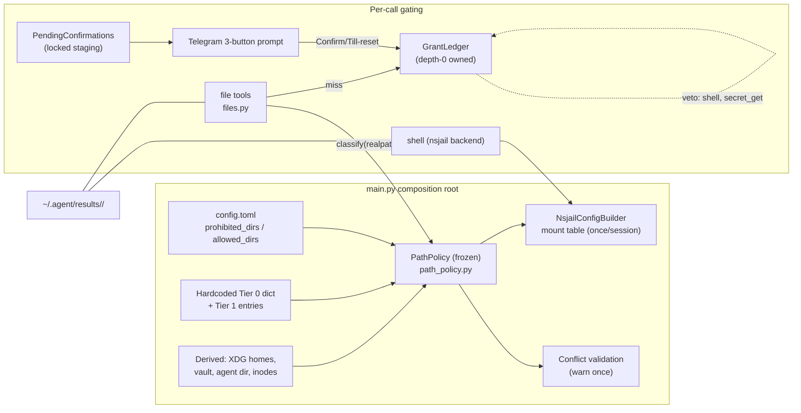
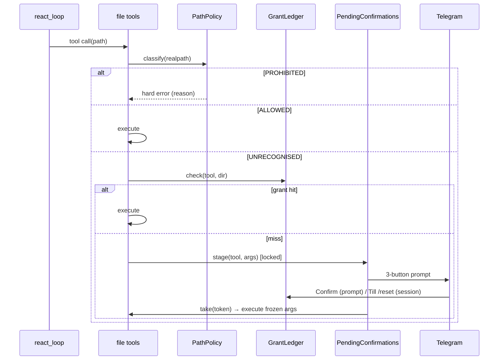

# Design — unify-access-control

## Context

The files-and-folders access plane currently answers "may the agent touch this path?" with 7+ lists across 5 files: three nsjail blocklist tuples (`nsjail_config.py:23-43`), zone tiers + inode overrides (`access_control.py`), sensitive-path patterns (`patterns.py:28-43`), an approve-all allowlist (`telegram_callbacks.py:24`), ephemeral request grants (`GrantTracker`), and `auto_approve_tools`. The dynamic trust store (`trusted_dirs.json`) is re-read per nsjail call and can silently diverge from what the jail actually mounts. The main-agent "Approve all" accepts any tool including `shell` (C-16 finding), while sub-agents are correctly restricted.

In-force ADR constraints relevant here (from the supersession graph): ADR-0010 (zone-based access control — superseded by this design), ADR-0011 (per-prompt approval scope — partially superseded: approve-all invariant preserved via sink vetoes), ADR-0017 (session-logs RO mount — reversed by this design), ADR-0018 (default trusted zones mounted into nsjail — mount *source* changes, semantics preserved), ADR-0024 (unified confirmation signaling in coordinator — grant ledger replaces `auto_approve_tools`, signaling flow preserved), ADR-0019 (XDG layout — resolution logic unchanged; skills/results live outside it), ADR-0015 (nsjail state outside sandbox write scope — unchanged). ADR-0008:52-54's ConfirmationCoordinator deferral is resolved by this change without the full merge (see Decisions D6).

**Stakeholders**: the operator (Telegram UX: 3-button confirmations, static config), the agent (file tools, shell-in-jail, results exchange), and future maintainers (one policy object to audit instead of seven lists).

## Goals / Non-Goals

**Goals:**
- Single three-tier path policy (Prohibited / Agent-controlled / Operator-allowed) consumed by both the file tools and the nsjail builder.
- One grant mechanism: `(tool, dir-recursive)` × lifetime {prompt | session}, sink-side vetoes, in-memory only.
- Close the agent XDG data/state/config home entirely; jail no longer mounts session logs (logs via `log_query` SQL).
- New `~/.<agent>/results/<trace-id>/` exchange surface for oversized payloads.
- nsjail mount table built once per session (static config ⇒ no per-call rebuilds, no store/jail divergence).
- Delete: TrustedZoneChecker, trusted_dirs.json, zone buttons, GrantTracker, sensitive-path overlay, auto_approve_tools asymmetry.

**Non-Goals:**
- Execution plane: `_DANGEROUS_SHELL_PATTERNS`, `shell_nsjail_confirm_mode`, PTY/subprocess internals, seccomp enablement.
- macOS support.
- Any content-based secret scanning (DLP) — accepted risk, named in Risks.
- Migration of existing trusted_dirs.json grants (silent ignore, per user decision).
- Full `ConfirmationCoordinator` merge (rejected; see D6).

## Decisions

### D1 — `PathPolicy`: one frozen, session-static policy object (new module `path_policy.py`)

Constructed at startup: hardcoded Tier 0 dict (system dirs — **superset of the live `_BLOCKED_SYSTEM_PREFIXES`, including `/root`, `/run`, `/lib64`**, plus credential homes) + derived entries (XDG data/state/config home, vault file, agent dir) + config-appended `prohibited_dirs` + Tier 1 entries (workspace, downloads, `/tmp/<agent>`, `~/.<agent>/skills` r, `~/.<agent>/results` rw) + config `allowed_dirs`. Conflict validation runs once at construction: an allowed_dir containing/underlying a prohibited path → warning, prohibited wins. The object is frozen (no mutators) — nothing can modify policy at runtime, which is what makes once-per-session jail builds sound (verified: only `Scheduler.reload()` exists and it reloads jobs, not security config).

Classification is a pure function `classify(realpath, operation) -> PROHIBITED | ALLOWED(r|rw) | UNRECOGNISED`, reusing `_is_contained`'s boundary-safe, normcase-aware matching. Inode-alias defense generalizes `_collect_override_inodes`: stat at startup, deny by `(st_dev, st_ino)` for prohibited *files* (vault, config). Why one object over per-plane lists: the trust-store/jail divergence bug class is structurally impossible when there is one store, and "what can the agent touch?" gets one auditable answer.

*Alternative rejected*: layered manifests with per-surface visibility (Variant B/C from exploration) — more expressive (e.g. "file-ok, jail-no") but adds config vocabulary; YAGNI until a real use case appears.

### D2 — Prohibited = hard error, never a prompt

Tool result: `{"success": false, "error": "Permission denied: prohibited path (<reason>)", "error_type": "prohibited_path"}`. Reason strings come from the Tier 0 dict. Rationale: for credential homes, prompting is a fatigue-exploitation vector (93% acceptance rate); denial is the only safe default. This is a semantic change from today (everything was askable) and is called out as BREAKING. Immune to grants and to operator recklessness (`allowed_dirs=["/"]` changes nothing for Tier 0).

### D3 — Grant ledger replaces all standing/ephemeral consent

New `GrantLedger` (in `confirmation.py`, owned by depth-0 `ConfirmationManager`): entries `(tool, dir, lifetime, scope_owner)`. Recursive dir semantics (`/data` ⇒ `/data/**`) matching zone/jail semantics. Two lifetimes: `prompt` (cleared at `react_loop()` entry — the existing `GrantTracker.reset()` boundary) and `session` (cleared by `/reset`). Single ledger, depth-0-owned; sub-agent prompt grants carry a scope annotation (the sub-agent's registry handle) and expire when that run completes — no upward privilege leak. `shell` and `secret_get` are **vetoed at the ledger check** (`may_hold_grant(tool) -> False`) — sink-side, crafted-callback-proof; their prompts render Confirm/Deny only (no dead "Till /reset" button). Prohibited immunity is structural: classification runs *before* the ledger check, so a grant can never be consulted for a Tier 0 path.

### D4 — File-tool gate sequence (replaces `_gate` + zone buttons)

```
_exec_* → realpath → PathPolicy.classify()
    PROHIBITED → hard error (D2)
    ALLOWED    → execute
    UNRECOGNISED → GrantLedger.check(tool, parent-dir)
        hit  → execute
        miss → PendingConfirmations.stage(token) → 3-button prompt
               Confirm      → ledger.add((tool, dir), prompt-lifetime)
               Till /reset  → ledger.add((tool, dir), session-lifetime)
               Deny         → denial result
```

`file_patch`'s confirm-before-read (content-oracle fix) is preserved: the description is built from args only. `file_diff` classifies both paths; a prohibited path on either side fails the whole operation. Checker-unwired degradation is deleted — PathPolicy is constructed in `main.py`; failure to construct is a startup error (fail closed).

### D5 — nsjail mount table from the policy, built once per session

`NsjailConfigBuilder` receives the frozen PathPolicy. Mount set = Tier 1 (skills r, results rw, workspace rw, downloads rw, tmp as today) + Tier 2 minus Tier 0 overlap. An allowed_dir that *contains* a prohibited path is **not mounted** (no partial bind mounts; warning at startup) — file-plane access for it remains as configured, so the jail never silently becomes a no-op. Structural mounts (`/usr`, `/dev/null`, resolv.conf, CA store, session tmpdir) stay code-owned. The generated config is built once at session start and cached; per-call `-E` env injection unchanged. Session-logs mount removed (ADR-0017 reversed — `log_query` serves the SQLite store).

### D6 — Confirmation plumbing: targeted fixes, no full merge

The C-16 analysis (oracle) showed the two objects have genuinely different responsibilities — staging/execution (`BuiltinExecutor`) vs blocking/signaling (`ConfirmationManager`). The full `ConfirmationCoordinator` merge would increase coupling. Instead: (a) the grant ledger lives in the coordinator and the sink-side veto closes the main-agent `shell` hole; (b) `PendingConfirmations` (locked, from the C-16 plan) encapsulates `_pending`/`_zone_paths`/`_zone_trackers` with a run-scoped `reset()` at depth-0 `_run` finally — closing the orphan-leak and non-atomic-staging holes; (c) zone callbacks (`cb_zone_*`) and "Approve all" buttons are deleted outright, so hole #5 (dead-token trust) dies with them.

### D7 — Results directory

`~/.<agent>/results/<trace-id>/` (trace IDs reused from `trace_context.py`). Oversized shell artifacts relocate here from `_finalize_shell_log`'s current location; `_vault_secrets` redaction retained. Whole dir mounted rw (jail config is session-static; per-trace mounts would reintroduce per-call builds). Retention: manual clean — no TTL, no startup sweep. Accepted consequence: everything in results is readable by any later jail process in the session; results is the designated exchange surface.

### D8 — Config schema additions (`config_schema.py`)

`[security]` section: `prohibited_dirs: list[str]` (append-only, validated at startup — unresolvable/nonexistent paths warn but do not fail), `allowed_dirs: list[str]` (rw-only; `~`-expanded, realpath'd at startup). No mode syntax — read-only-ness exists only in hardcoded Tier 1. Config file lives inside the prohibited `~/.config/<agent>` — self-protecting by construction (the agent can never read or patch its own config).

### Carry-forward resolution (from proposal review)

No delta specs for `xdg-path-resolution` / `agent-xdg-launch` / `vault-config-resolution`: their resolution logic is untouched; only *access policy* to those dirs changes, which is owned by `path-policy`. Design decision recorded here; the adr step will note the supersessions.

### Component view (C4-inspired, lightweight)



- Boundaries: policy is constructed only at startup and frozen; runtime components only *read* it.
- The grant ledger sits between classification and prompting — prohibition immunity is ordering, not a check.
- The jail builder shares the same PathPolicy the file tools use — the divergence bug class is eliminated.

### Dynamic view — confirmation flow (depth-0, interactive)



**Assumptions**: single depth-0 ledger; sub-agent confirmations bridge through the existing headless mechanism with a scope annotation; trace IDs already exist for results subdirs.

## Risks / Trade-offs

- [Single choke point: a PathPolicy validation gap ships a gap] → Tier 0 enumeration must be a superset of the live blocklists (task-level test: generate current tuples, assert containment); fail-closed startup error.
- [Losing per-call trust updates: operator must edit config + restart to add a dir] → accepted (the design goal); session grants cover the interim.
- [Deleting the sensitive-path overlay: a workspace `.env` is now freely readable once the dir is allowed] → accepted deliberately: renaming defeated the overlay; credential *directories* are hard-denied; secrets belong in the vault. Named as accepted risk, not silently dropped.
- [Results as exfiltration staging (any jail process reads any run's artifacts)] → accepted: designated exchange surface; vault redaction retained for shell artifacts.
- [`allowed_dirs=["/"]` reckless config: file tools run loose everywhere except Tier 0] → by design; jail still mounts only Tier 1 + valid Tier 2 (no partial mounts), so shell remains sandboxed.
- [BREAKING UX: operators lose zone buttons and Approve-all] → config + README updated; grant-ledger UX (3 buttons) covers the legitimate use cases with strictly less blast radius.
- [Concurrency: staged tokens vs. zone callbacks raced under GIL-only assumptions today] → `PendingConfirmations` lock closes the window; zone callbacks deleted.

## Migration Plan

1. New `path_policy.py` + `GrantLedger` alongside old code, tests first (pure additions, old paths still live).
2. Rewire file tools to PathPolicy + ledger; delete TrustedZoneChecker/GrantTracker/sensitive overlay and their tests; hard-deny prohibited paths.
3. nsjail builder consumes PathPolicy, once-per-session build; remove session-logs mount; relocate skills (one-time first-run copy) and add results dir.
4. Telegram: 3-button UX, remove zone buttons and approve-all; rewire sub-agent bridge with scoping.
5. Config schema + `config.toml.example` + README; startup derivation + conflict validation.
6. Cleanup: delete dead code paths, update vulture whitelist, run `make check`.
Rollback: revert per commit; no persisted state is created (grants in-memory, trusted_dirs.json untouched and ignored), so rollback carries no data migration.

## Open Questions

None blocking implementation. The adr step must record supersessions: ADR-0010 (fully), ADR-0011 (approve-all mechanism half — the always-confirm-for-shell invariant is *preserved and strengthened* via sink veto), ADR-0017 (reversed), ADR-0018 (mount-source half; trusted-zone-mount semantics preserved), ADR-0024 (partial: grant storage; signaling flow preserved), and notes for ADR-0015/0019 (references change, decisions unchanged). ADR-0008's deferred ConfirmationCoordinator item is resolved-by-subsumption (D6).