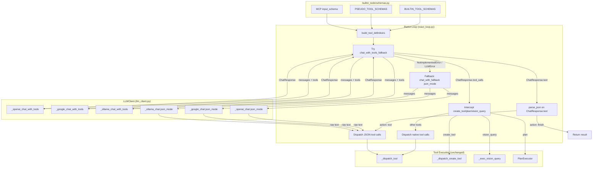

## Context

The ReAct loop (`react_loop.py`) currently calls `ctx.llm.chat_with_fallback(json_mode=True)` to get a text response, then runs `parse_json()` to extract a `{"action": "tool", "tool": "...", "args": {...}}` object. This text-based path is the only path. Models like Kimi and GLM fail to produce valid JSON 1-2 times per execution, triggering retries and wasted steps.

All four providers in active use (Kimi, GLM, DeepSeek, Gemini) plus Ollama support native tool calling via OpenAI-compatible endpoints. The `LLMProvider` protocol (`interfaces.py`) currently has `chat()` and `chat_with_fallback()` returning `str`. The `LLMClient` (`llm_client.py`) implements these with provider-specific methods (`_openai_chat`, `_google_chat`, `_ollama_chat`).

ADR-0007 establishes `AgentRuntime` as the construction boundary and `ReactContext` as the per-run state carrier. ADR-0008 establishes the façade + handler-module package for built-in tools, with `BUILTIN_TOOLS` descriptors in `builtin_tools/descriptors.py`. Both are in force and constrain this design.

## Goals / Non-Goals

**Goals:**
- Add a native tool calling path to the ReAct loop that bypasses JSON parsing for tool dispatch
- Keep the existing text-based JSON path as a universal fallback
- Support all four active providers (OpenAI-compatible, Google Gemini, Ollama) with native tool calling
- Provide JSON Schema parameter definitions for all built-in tools, MCP tools, and `create_tool`/`plan` pseudo-tools
- Handle `create_tool`, `plan`, and `vision_query` as special-case intercepts before `_dispatch_tool()`

**Non-Goals:**
- Multi-tool calls in a single turn (single tool call per turn, matching current behavior)
- Schema generation for script tools (`.sh`/`.py`) — these are being phased out
- Changing prompt templates — JSON instructions remain for the fallback path
- Changing tool execution, confirmation flow, context compaction, or cancellation
- Anthropic native API support (not in use)

## Decisions

### 1. New protocol methods: `chat_with_tools()` and `chat_with_tools_fallback()`

**Decision:** Add two new methods to `LLMProvider` returning a `ChatResponse` dataclass. Keep `chat()` and `chat_with_fallback()` unchanged.

**Rationale:** A dedicated method with a dedicated return type avoids breaking existing callers. The `ChatResponse` dataclass cleanly represents the two possible outcomes (text or tool calls) without union types.

**Alternatives considered:**
- Extending `chat()` with an optional `tools` parameter → breaks backward compatibility (existing callers expect `str`)
- Separate `NativeToolCallingProvider` protocol → over-engineering; one protocol with optional methods is simpler

**New types in `interfaces.py`:**

```python
@dataclass
class ToolCall:
    id: str
    name: str
    arguments: dict[str, Any]

@dataclass
class ChatResponse:
    text: str | None = None
    tool_calls: list[ToolCall] | None = None

    @property
    def is_tool_call(self) -> bool:
        return bool(self.tool_calls)
```

**New methods on `LLMProvider`:**

```python
def chat_with_tools(
    self, messages: list[dict], tools: list[dict],
    system: str | None = None, progress_cb=None,
) -> ChatResponse: ...

def chat_with_tools_fallback(
    self, messages: list[dict], tools: list[dict],
    system: str | None = None, progress_cb=None,
) -> ChatResponse: ...
```

### 2. Provider implementations: OpenAI-format tool calling for all providers

**Decision:** All four providers use the OpenAI function-calling format (`tools` array with `{"type": "function", "function": {...}}`). Each provider gets a `_*_chat_with_tools()` method that mirrors the existing `_*_chat()` method but adds `tools`/`tool_choice` to the payload and parses `tool_calls` from the response. Native requests are non-streaming (same as existing `_*_chat()` methods) — `progress_cb` is passed through for retry/fallback notifications only, not for streaming deltas.

**Rationale:** Kimi, GLM, DeepSeek, and Ollama all use OpenAI-compatible endpoints. Google Gemini's OpenAI-compatible endpoint also supports this format. One format for all providers simplifies the implementation. Non-streaming avoids the complexity of assembling partial `tool_calls` fragments.

**Provider-specific details:**

| Provider | Method | `tool_choice` | Notes |
|----------|--------|---------------|-------|
| OpenAI-compat (Kimi, GLM, DeepSeek) | `_openai_chat_with_tools()` | `"auto"` | Kimi/GLM don't support `"required"` |
| Google Gemini | `_google_chat_with_tools()` | `"auto"` | Via OpenAI-compatible endpoint |
| Ollama | `_ollama_chat_with_tools()` | `"auto"` | Model-dependent support |

**Payload differences from `_openai_chat()`:**
- Add `"tools": tools` to payload
- Add `"tool_choice": "auto"` to payload
- Remove `"response_format": {"type": "json_object"}` — mutually exclusive with tools
- Parse `choices[0].message.tool_calls` instead of `choices[0].message.content`
- If `tool_calls` is empty/missing, return `ChatResponse(text=content)`

**`chat_with_tools_fallback()`** mirrors `chat_with_fallback()` exactly: same fallback chain logic, same vision-model filtering, same `_active_idx` management. Calls `chat_with_tools()` instead of `chat()`.

### 3. Tool schemas: `builtin_tools/schemas.py` with `BUILTIN_TOOL_SCHEMAS` and `build_tool_definitions()`

**Decision:** A new `builtin_tools/schemas.py` module (co-located with `descriptors.py` per ADR-0008) containing:
- `BUILTIN_TOOL_SCHEMAS`: a `dict[str, dict]` mapping tool names to OpenAI-format parameter schemas for all 15 built-in tools
- `PSEUDO_TOOL_SCHEMAS`: a `dict[str, dict]` for `create_tool` and `plan` (not in `BUILTIN_TOOLS` descriptors — they are action types, not built-in tools)
- `build_tool_definitions(builtin_executor, mcp_manager) -> list[dict]`: merges built-in schemas, pseudo-tool schemas, and MCP `input_schema` into a single OpenAI-format tool definitions array

**Rationale:** Co-locating with `descriptors.py` follows ADR-0008's principle that per-built-in-tool metadata lives in the `builtin_tools/` package. The arg descriptions in `descriptors.py` and the JSON Schema `properties` in `schemas.py` are kept in sync manually — both describe the same tool interface. Pseudo-tools are separate constants because they are not built-in tools (no handler in `BuiltinExecutor`, no descriptor in `BUILTIN_TOOLS`).

**Schema format (OpenAI function-calling):**
```python
{
    "type": "function",
    "function": {
        "name": "shell",
        "description": "Execute a shell command on the host system.",
        "parameters": {
            "type": "object",
            "properties": {
                "command": {"type": "string", "description": "The shell command to execute."},
                "timeout": {"type": "integer", "description": "Timeout in seconds (default: 30)."},
            },
            "required": ["command"],
        },
    },
}
```

**`build_tool_definitions()` assembly order:**
1. Iterate `BUILTIN_TOOL_SCHEMAS` → produce `{"type": "function", "function": {"name": name, **schema}}`
2. Iterate `PSEUDO_TOOL_SCHEMAS` → same format
3. Iterate MCP tools → `{"type": "function", "function": {"name": tool.name, "description": tool.description, "parameters": tool.input_schema}}`

**Caching:** `build_tool_definitions()` is called once at loop start. Result is cached on `ctx._tool_defs` (a new field on `ReactContext`). Tools don't change mid-run.

### 4. ReAct loop integration: native-before-text with fine-grained fallback

**Decision:** The ReAct loop tries `chat_with_tools_fallback()` first. The response is handled in one of three ways:

1. **`ChatResponse(tool_calls=[...])`** → dispatch natively (intercept `create_tool`/`plan`/`vision_query`, route others to `_dispatch_tool()`)
2. **`ChatResponse(text=...)`** → run `parse_json()` on the returned text in place (no re-query). This handles `finish` actions and models like Kimi/GLM that return text instead of tool calls
3. **`NotImplementedError` or transient `LLMError`** → fall through to a fresh `chat_with_fallback(json_mode=True)` call (the existing path)

**Error handling:**
- `NotImplementedError` → fall through to `json_mode` (provider doesn't support tools)
- Transient `LLMError` → retry once with native, then fall through to `json_mode`
- `LLMPermanentError` → propagate immediately (bad API key, content filter — `json_mode` won't help)
- Other exceptions → log warning, fall through to `json_mode`

**Special-case intercepts** (before `_dispatch_tool()`):
- `create_tool` → route to `_dispatch_create_tool()`
- `plan` → route to plan execution path
- `vision_query` → route to `_exec_vision_query()` (per `builtin-tool-execution` spec: loop executes it, not executor dispatch)

**Native tool result feedback:**
```python
messages.append({
    "role": "assistant",
    "content": None,
    "tool_calls": [{
        "id": tc.id,
        "type": "function",
        "function": {"name": tc.name, "arguments": json.dumps(tc.arguments)},
    }],
})
messages.append({
    "role": "tool",
    "tool_call_id": tc.id,
    "content": tool_result,
})
```

**`finish` detection:** When the model returns text with no tool calls, `parse_json()` must find `{"action": "finish"}`. Non-JSON text is treated as a protocol error (same as today's `json_fail_streak` path). This means every successful task completion via the native path involves one LLM call (the native call that returns text), not two — the text is parsed in place.

### 5. Component diagram: ReAct loop with native path



**Key relationships:**
- `build_tool_definitions()` reads from `BUILTIN_TOOL_SCHEMAS`, `PSEUDO_TOOL_SCHEMAS`, and MCP `input_schema`, produces OpenAI-format tool definitions
- The native path (`chat_with_tools_fallback`) sends `messages + tools` to provider-specific `_*_chat_with_tools()` methods and receives `ChatResponse` back
- `ChatResponse.tool_calls` → intercept `create_tool`/`plan`/`vision_query`, dispatch others via `_dispatch_tool()`
- `ChatResponse.text` → `parse_json()` in place (no re-query). Handles `finish` and text-based tool calls
- `NotImplementedError` / transient `LLMError` → fresh `chat_with_fallback(json_mode=True)` call (the existing path)
- Tool execution (`_dispatch_tool`, `BuiltinExecutor`, MCP) is unchanged

## Risks / Trade-offs

- **[Risk] Dual-instruction confusion**: The system prompt still says "respond with ONLY a single valid JSON object" while tools are available. Native-capable models may still emit JSON-in-text alongside tool calls. → **Mitigation**: The parse-in-place path absorbs this — if the model returns text, `parse_json()` handles it. If it returns tool calls, the native path handles it. No conflict at runtime.
- **[Risk] Kimi/GLM may return text instead of tool calls**: These models don't support `tool_choice="required"`, so they may choose to return text even when tools are available. → **Mitigation**: The parse-in-place path handles this transparently — `parse_json()` runs on the returned text. The model still benefits from having tool schemas in context (better JSON output).
- **[Risk] Tool definition size**: 15 built-in tools + 2 pseudo-tools + MCP tools could produce a large `tools` array, consuming context window. → **Mitigation**: Well within OpenAI's 128-function limit. MCP tools are typically few. If this becomes an issue, we can add a `top_tools` filter (same as the text path already does).
- **[Risk] Ollama model-dependent support**: Not all Ollama models support tool calling. → **Mitigation**: `_ollama_chat_with_tools()` catches errors and raises `LLMError`, which triggers the fallback path. Models that don't support tools fall through to `json_mode` transparently.
- **[Risk] Descriptor/schema drift**: `descriptors.py` arg descriptions and `schemas.py` JSON Schema `properties` describe the same tool interfaces but are maintained separately. → **Mitigation**: Both files are in `builtin_tools/` and are updated together when a tool changes. A comment in `schemas.py` notes the co-location dependency.
- **[Trade-off] Single tool call per turn**: We're not implementing multi-tool calls in this iteration. The model may request multiple tools but we only dispatch the first one. → This matches current behavior and keeps scope minimal. Multi-tool support can be added later.

## Migration Plan

**Deployment:** No configuration changes required. The native path is tried automatically; if it fails, the existing `json_mode` path takes over. No downtime, no feature flags.

**Rollback:** If native tool calling causes issues, the fallback path ensures the agent continues working. To fully disable, the `chat_with_tools_fallback()` call in `react_loop.py` can be wrapped in a config flag — but this is not needed for initial deployment given the robust fallback.

**Testing:** Existing tests for `parse_json()`, `_dispatch_tool()`, confirmation flow, and context compaction continue to pass unchanged. New tests needed for:
- `build_tool_definitions()` output format (built-in + pseudo + MCP merge)
- `ChatResponse` dataclass behavior
- Native dispatch path in the ReAct loop (using `ScriptedLLM` from `execution_harness.py`)
- Provider `_*_chat_with_tools()` payload construction and response parsing
- Parse-in-place path: `ChatResponse.text` → `parse_json()` → `finish` detection

## Open Questions

*(none — all questions resolved in explore phase)*
