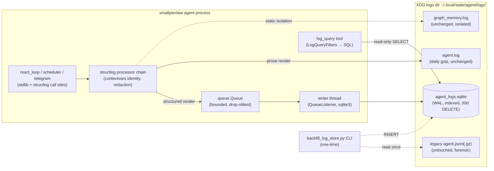

## Context

ADR-0004 established the structlog dual-sink backbone: one processor chain renders every record to a machine-readable primary sink (`agent.jsonl`) and a human prose sink (`agent.log`). ADR-0023 tightened the contract to record-exactly-once lifecycle events with a closed ten-member `LogEvent` taxonomy, run identity via contextvars, secret redaction at the shared filter layer, and component log isolation for `graph_memory`.

The query side never matched the write side's maturity. `log_query` (`builtin_tools/secrets_log.py`) reads only the active `agent.jsonl` through a bounded tail window (1MB / 5000 lines, `logquery_helpers.py`). Records older than the current file — everything in the 30 days of gzip-rotated backups — are invisible to the agent. The bounded window, per-record predicate builder, and saturation flags exist solely to compensate for an unindexed storage format. Both ADRs anticipated this moment: ADR-0004 deferred a queryable store as unnecessary for "recent events in this run"; ADR-0023's follow-up note states that a queryable store "supersedes the active-file query approach, not this contract."

The gap C-34 targets is now concrete: prompt-scoped analysis for any prompt older than the active file (scheduled jobs, yesterday's runs, cross-run failure aggregation) is impossible through tooling.

## Goals / Non-Goals

**Goals:**
- Replace the structured `agent.jsonl` sink with a SQLite WAL store (`agent_logs.sqlite`) in the same XDG logs directory; the prose `agent.log` sink is untouched.
- Make the full 30-day retention queryable via indexed SQL: trace/prompt lookups across day boundaries, time-range queries, and aggregation.
- Preserve the entire `log_query` filter surface (trace, level, event_type, tool, since, text, prompt_id, limit) and the high-signal default view ("Option C").
- Delete the tail-window/predicate machinery; replace window-saturation semantics with an exact `total_matched`.
- Keep the ADR-0004 backbone (structlog chain, contextvars identity, closed taxonomy, redaction) and the ADR-0023 exactly-once contract byte-for-byte in behavior.
- Provide a one-time, idempotent backfill CLI for existing JSONL archives (additive only; archives stay untouched).
- No new dependencies — stdlib `sqlite3`.

**Non-Goals:**
- No config toggle between JSONL and SQLite (hard swap; the old path is the complexity being deleted).
- No FTS5 full-text index (substring matching over `search_text` at this scale is milliseconds; FTS5 recorded as a future option).
- No changes to the prose sink, component log isolation (`graph_memory.log`), or the `LogEvent` taxonomy.
- No analytics/dashboard UI; `log_query` remains the only in-process consumer.
- No migration or deletion of existing JSONL archive files.

## Decisions

### D1: Hard swap, no dual-write toggle

The store replaces `agent.jsonl` outright; there is no `logging.store: jsonl | sqlite` option. A toggle would double the test matrix and preserve the window machinery as a rollback path, defeating the simplification that justifies the change. Rollback is git-level (revert), not runtime.

*Alternative rejected:* config toggle — keeps dead code alive and lets the two paths drift.

### D2: Schema — wide columns for the closed taxonomy, `extra` JSON for the rest

```sql
CREATE TABLE events (
    id INTEGER PRIMARY KEY,
    ts TEXT NOT NULL,           -- ISO 8601, lexicographically sortable
    level TEXT NOT NULL,        -- lowercase structlog names: debug..critical
    logger TEXT,
    agent TEXT,                 -- 'main' | 'sa-<id>' | job tag
    trace TEXT,                 -- r-<8 hex>
    prompt_id TEXT,
    event_type TEXT,            -- LogEvent value or NULL
    msg TEXT,
    extra TEXT,                 -- JSON: tool, exit, dur_ms, err, model, ...
    search_text TEXT NOT NULL   -- pre-casefolded compact JSON of the full record
);
CREATE INDEX idx_ts         ON events(ts);
CREATE INDEX idx_trace      ON events(trace);
CREATE INDEX idx_prompt_id  ON events(prompt_id);
CREATE INDEX idx_agent      ON events(agent);
CREATE INDEX idx_event_type ON events(event_type) WHERE event_type IS NOT NULL;
```

Field mapping from the current JSONL record: `ts`, `level`, `logger`, `agent`, `trace`, `prompt_id`, `event_type`, `msg` → wide columns; every remaining field (tool, exit, dur_ms, err, model, tokens, step, goal, …) → `extra` JSON. `event_type` gets a partial index (NULL for non-lifecycle records, so the index stays small). The `tool` filter uses `json_extract(extra, '$.tool')` — exact-match on a low-cardinality key, milliseconds at this scale, no denormalization needed. Same pattern converged on by `agentic-logger` and `atomic_agents` (surveyed during exploration).

`search_text` is written once at ingestion: the compact JSON serialization of the **full record dict** (all wide columns + extras — exactly what `logquery_helpers.filter_log_lines` serializes today), passed through Python `.casefold()` so the fold is full-Unicode (e.g. `ß→ss`), matching the current text-search semantics. It duplicates the record content (~2× storage, tens of MB at this scale — accepted) so text search stays a single-column indexed-friendly operation with exact `COUNT(*)` support and no query-time multi-column folding.

*Alternative rejected:* one column per known operational field — schema churn every time a call site adds a field; the JSONL record shape already treats these as open.

### D3: Write path — QueueHandler → QueueListener single writer, WAL

The structlog chain is untouched. The structured sink handler becomes a `logging.QueueHandler` feeding a `queue.Queue`; a `QueueListener` on a daemon thread owns the only connection and performs batched INSERTs in short transactions. Rationale:

- **Multi-writer safety**: react loop, sub-agents (pool threads), scheduler, Telegram callbacks all log; the queue serializes them so no SQLite locking can surface in the hot loop.
- **Hot-path latency**: enqueue is a `queue.put` — cheaper than the current file append.
- **WAL pragmas**: `journal_mode=WAL`, `synchronous=NORMAL` — committed transactions survive process kill via WAL replay, matching JSONL's "at most one partial line" loss profile (the current handler does not fsync per line either).
- **Crash cost**: whatever is in the in-memory queue at kill time — same order of magnitude as a truncated JSONL line.

A flush hook on graceful shutdown drains the queue before exit (daemon stop path must drain or explicitly accept loss; the queue listener's `stop()` performs the drain). Bounded queue with a drop-on-overflow policy (drop oldest, increment a dropped counter, emit a WARNING to the prose sink) — logging must never block or OOM the agent.

*Alternative rejected:* direct per-record INSERT with `timeout=` retries — surfaces DB contention in the react loop and couples hot-path latency to disk.

### D4: Retention — 30-day time-based DELETE

A startup task (plus a daily timer) runs `DELETE FROM events WHERE ts < cutoff` followed by `PRAGMA wal_checkpoint(TRUNCATE)`. Same retention horizon as today (30 backups ≈ 30 days), simpler mechanism, and it keeps the DB self-pruning. VACUUM is deliberately not run on schedule (bloat is acceptable; a backup/restore cycle reclaims space).

### D5: Read path — `log_query` compiles filters to SQL

`LogQueryFilters` is retained as the argument-normalization layer (its shape is good and tested); the tail reader, JSONL parser, and predicate builder are deleted. The filter surface compiles to SQL:

| Filter | SQL |
|---|---|
| trace | `trace = ?` |
| level (min) | `level IN (...)` — closed ordered set of **lowercase** stored names (`'warning','error','critical'` for min WARNING) |
| event_type | `event_type = ?` |
| tool | `json_extract(extra, '$.tool') = ?` |
| since | `ts >= ?` (ISO prefix → range start) |
| text | `instr(search_text, ?) > 0` with the casefolded needle — literal substring, no wildcard semantics (1:1 with today's Python `in` test; `%`/`_` in needles are ordinary characters). (`LIKE ? ESCAPE '\'` with escaped needle is the equivalent alternative.) |
| prompt_id | `prompt_id = ?` (exact match only — there is no prompt_id substring filter) |
| limit | `ORDER BY ts DESC, id DESC LIMIT ?` then re-ascended for output |

Trace-scope resolution is preserved unchanged and runs **before** SQL compilation: explicit `trace` argument wins; otherwise the query auto-widens to all traces when `text` or `prompt_id` is given; otherwise it defaults to the current run's contextvars trace. This resolution stays in `_exec_log_query`; only the record-fetching tail-scan beneath it becomes SQL.

The "Option C" default view is preserved as SQL: no explicit level/event filter → `event_type IN ('TOOL_START','TOOL_END','TOOL_FAILED','LLM_CALL','LLM_FAILED','ERROR') OR level IN ('warning','error','critical')`. The authoritative event set is this six-event set per the brief; the current `_LOG_QUERY_DEFAULT_INCLUDE_EVENTS` frozenset ({TOOL_START, TOOL_END, LLM_CALL}) plus WARNING+ is operationally equivalent for today's emitters (failure events are always ≥ WARNING), and the rewrite must implement the SQL exactly as written — not "fix" the frozenset-to-SQL mapping in a way that changes which records surface.

Response contract: `records`, `count`, `truncated`, `total_matched` (now exact — `SELECT COUNT(*)` with same WHERE); `window_saturated` and `scanned_lines` are removed. Per-field 500-char projection and the `max_output` size cap are unchanged.

### D6: Backfill — idempotent, additive-only CLI

`backfill_log_store.py` (pattern: `backfill_graph_memory.py`) reads `agent.jsonl` and all `agent.jsonl.*.gz` in the logs dir, parses each line, maps to the schema, INSERTs in batches. `search_text` is `NOT NULL`, so the backfill computes the same casefolded compact-JSON serialization for every imported row — imported rows are queryable by text exactly like live rows. Idempotency: the source filename + line offset (or a content hash of the line) recorded in an `imported` bookkeeping column/table prevents double-import on re-run. Malformed lines are skipped with a count reported, not fatal. Source files are never modified or deleted (user-confirmed decision). Distinct from `backfill_graph_memory.py`, which is unaffected.

### D7: Backup semantics

Documented procedure: copy `agent_logs.sqlite` together with `agent_logs.sqlite-wal` (or run `PRAGMA wal_checkpoint(TRUNCATE)` first, then copy the single file). Replaces "copy the .jsonl/.gz files".

## Container boundary (what changes where)



- Boundaries: the processor chain's output contract (a dict per record) is the only interface the writer consumes; `log_query` talks to the DB read-only. The queue is the only write entry point.
- Responsibilities: storage mechanics (schema, ingestion, retention, checkpointing) live in `sqlite_log.py`; `agent_logging.py` only swaps handler wiring; query logic stays in `secrets_log.py`/`logquery_helpers.py`.
- Assumptions: write volume stays at tens of events/sec worst case (LLM latency dominates); retention horizon stays 30 days.
- The graph-memory isolation is untouched — its records never enter the chain's primary handlers, so they never reach the store.

## Dynamic flow: one log event, write then read

```mermaid
sequenceDiagram
    participant RL as react_loop (log_event)
    participant PC as processor chain
    participant Q as queue.Queue
    participant WT as writer thread
    participant DB as agent_logs.sqlite
    participant AG as log_query (same or later run)
    RL->>PC: emit TOOL_END {tool, dur_ms, trace, prompt_id}
    PC->>PC: redact, merge contextvars, timestamp
    PC-->>Q: enqueue rendered record dict
    PC-->>RL: return (hot path never blocks)
    WT->>Q: dequeue batch
    WT->>DB: INSERT ...; COMMIT (WAL)
    Note over AG,DB: hours or days later, any thread
    AG->>DB: SELECT ... WHERE prompt_id = ? ORDER BY ts
    DB-->>AG: exact rows across full 30-day retention
```

## Risks / Trade-offs

- [Writer thread dies silently → structured logs stop while prose continues] -> The writer catches all exceptions per batch, retries once, then re-opens the connection; on repeated failure it emits WARNING to the prose sink (which flows even if the store is down) and keeps the queue draining.
- [Kill -9 loses queued records] -> Accepted: bounded queue, same loss order as a truncated JSONL line; WAL replays all committed transactions. Graceful shutdown drains via `QueueListener.stop()`.
- [Backup procedure changes; users who copy only the .sqlite lose recent WAL data] -> Documented in README; retention checkpoint (`wal_checkpoint(TRUNCATE)`) runs daily so the window of risk is bounded.
- [DB corruption (disk full, bit rot) bricks both write AND query, unlike split files] -> Mitigated by WAL integrity guarantees + a startup `PRAGMA quick_check`; on failure the agent falls back to prose-only operation (structured sink disabled, WARNING emitted) rather than crashing — the react loop never depends on the store.
- [Grep/jq habits over agent.jsonl break] -> Replaced by `sqlite3` CLI one-liners; documented migration examples in README.
- [Backfill bug imports garbage] -> Idempotency bookkeeping allows a clean re-run (delete imported rows by source, re-import); source archives untouched, so forensics remain possible.
- [Text-substring search slower than indexed field lookups] -> `instr(search_text, ?)` at this scale is milliseconds (one linear scan of a text column); FTS5 remains a future option if profiling ever justifies it.

## Migration Plan

1. Add `sqlite_log.py` (schema, queue writer, retention) — inert until wired.
2. Swap the structured handler in `agent_logging.py`; delete JSONL structured handler. Old `agent.jsonl` files are simply no longer written (no rename dance).
3. Rewrite `log_query` read path to SQL; delete tail/predicate machinery; update `descriptors.py` output fields.
4. Add `backfill_log_store.py`; user runs it once to import history.
5. Update tests (`test_log_query.py` rewritten against a temp-file store; new writer/retention/backfill tests), docs (README logging section, AGENTS.md), `vulture_whitelist.py`.
6. Rollback: revert the commit; `agent.jsonl` writing resumes; the store file is ignored (backfill is re-runnable). No data-format lock-in because archives were never touched.

## Open Questions

- None blocking implementation. FTS5 and possible future aggregation tool extensions are recorded as non-goals/future options.
- ADR supersession: this design supersedes ADR-0004's *deferred-store* position and its "active-file, in-process query" mechanism (as ADR-0004/0023 themselves anticipated) — the ADR step will record this as a new ADR. The ADR-0004 structlog backbone decision and the ADR-0023 exactly-once contract remain in force, unchanged.